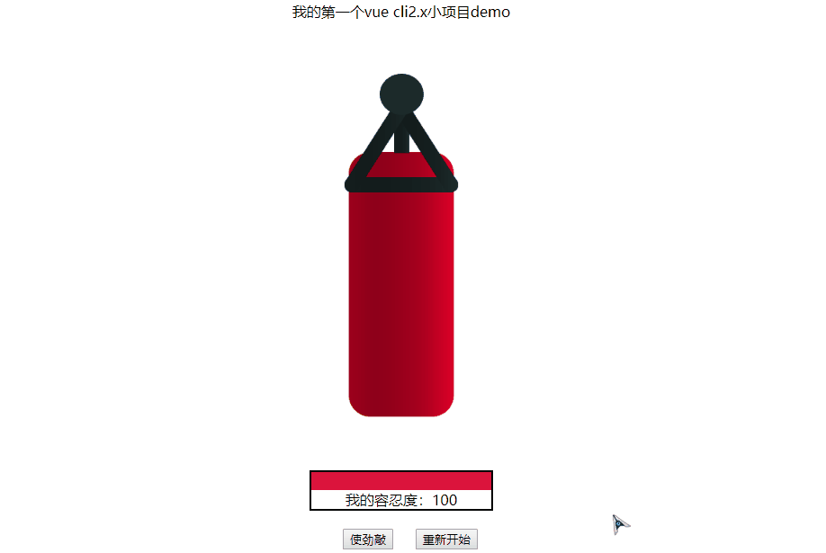

# vue-cli2.x-demo

**第一次使用vue-clix2.x搭建一个小demo游戏。代码文件有很多注释信息，通俗易懂的使用这个脚手架搭建一个入门小项目哈。**

## 介绍使用
- 使用默认创建的脚手架；
- 修改App.vue、HelloWorld.vue文件，assets文件夹添加了两张图片；
- 然后编译运行；

## 运行截图

## 参考文献
- Web前端网站教程-米斯特吴
